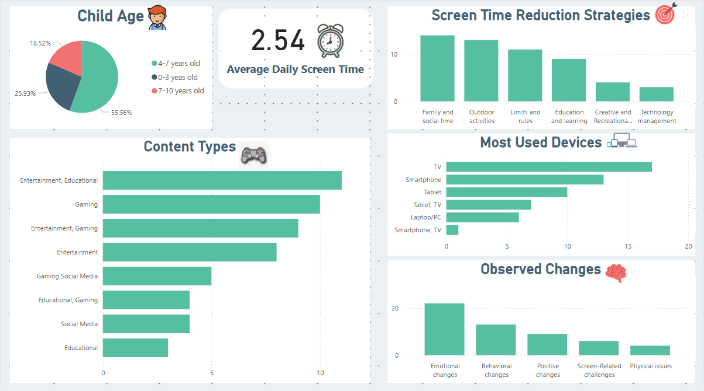

# 📊 Screen Time Analysis Project

## 🎯 Objective
This project analyzes screen time usage among kids using:
- **SQL**: Cleaning & analyzing structured data.
- **Excel**: Data organization & preliminary cleaning.
- **Power BI**: Creating dynamic visualizations.
- **Google Forms**: Designing & distributing surveys for data collection.
- **Jupyter Notebook**: Documenting workflow interactively.

---

## 🛠 Project Process Overview

### **1️⃣ Data Collection & Survey Design**
- Survey was designed using **Google Forms** and distributed to parents.
- Focused on:
  - Daily screen time
  - Device usage
  - Favorite apps
  - Behavioral impacts
- Responses categorized by **age group & screen habits**.

### **2️⃣ Data Cleaning & Organization**
- Used **SQL & Excel** to clean data:
  - Handled missing values, duplicates, and inconsistencies.
  - Structured datasets for analysis and visualization.

### **3️⃣ Data Analysis & Visualization**
Power BI generated insights such as:
- 📈 **Average daily screen time per age group**
- 📱 **Preferred digital platforms & content types**
- 🔎 **Observed behavioral & health changes**

Embedded **interactive dashboards** into **Jupyter Notebook** using the **Power BI API** for live reporting.

### **4️⃣ Interpretation of Results**
- Findings suggest **screen time affects mood, sleep, & physical health**.
- Identified **parental monitoring habits & strategies** for regulating screen time.

### **5️⃣ Recommendations & Strategies**
💡 **Alternative Activities:** Outdoor play, reading, family engagement.  
📏 **Parental Guidelines:** Screen-free zones, structured routines, role modeling.  
🎭 **Behavioral Strategies:** Usage limits, rewarding balanced screen habits, improving digital literacy.

